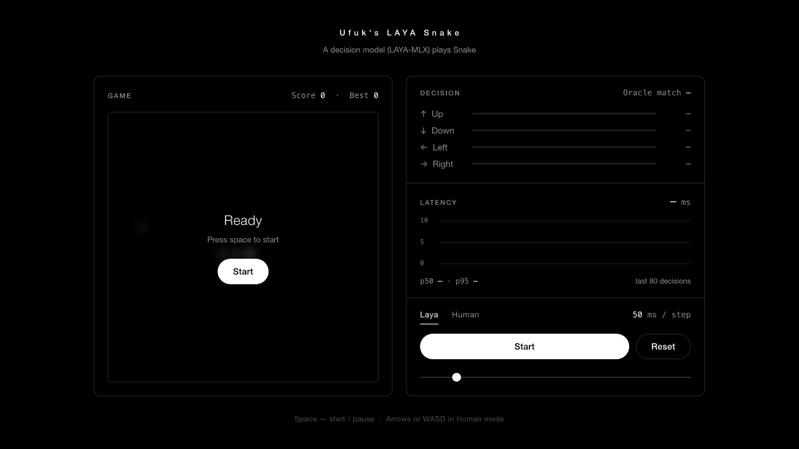

# Ufuk's Laya-MLX Snake

A minimalist Snake playground where the [laya-mlx](https://github.com/mizorewww/laya-mlx) typed decision model (`aac6fef/laya-mlx`) picks every move.



## Requirements

- Apple Silicon Mac
- Python 3.11+

## Install

```bash
cd snake
python3.11 -m venv venv
source venv/bin/activate
pip install -r requirements.txt
```

## Run

```bash
python3.11 server.py
```

Then open `http://127.0.0.1:8765` (it also opens automatically).

The model downloads once on first run (~850MB from Hugging Face) and then stays resident in memory for the life of the process. Startup includes a short warm-up so the first move is not slow.

## Files

| File | Purpose |
|---|---|
| `server.py` | HTTP server. Loads the model at startup, serves `index.html`, exposes `GET /api/info` and `POST /api/decide`. |
| `index.html` | The whole UI and game: board, decision panel, latency chart, controls. |
| `requirements.txt` | Python dependencies (`laya-mlx`). |
| `screenshot.png` | Screenshot used in this README. |

## How it decides

On every step the game turns the board into a short text description and asks the model one `choice` question. Each option is a sentence describing one safe move:

```json
{
  "move": {
    "type": "choice",
    "instructions": "Which move reaches the apple soon and stays alive?",
    "criteria": [
      "Move left: apple 4 steps away",
      "Move up: apple 6 steps away, traps snake in 5 cells"
    ]
  }
}
```

with a state text such as:

```text
Snake 20x20. Head (10,10) heading right. Length 5. Apple 3 left, 2 down. Hungry 4 steps.
```

- Moves that would hit a wall or the snake's body are removed before the model is asked. If only one safe move is left, the model is not called.
- The path length to the apple (BFS) and the free area reachable after the move are computed in the browser and written into each option.
- The option order is reshuffled on every step to avoid position bias.
- The option with the highest probability is played.
- If the snake goes 200 steps without eating, the game ends with **Stuck in a loop**.

## API

### `POST /api/decide`

```json
{
  "state": "Snake 20x20. Head (10,10) heading right. ...",
  "instructions": "Which move reaches the apple soon and stays alive?",
  "criteria": ["Move left: apple 4 steps away", "Move up: apple 6 steps away"],
  "hints": [-4, -6]
}
```

Response:

```json
{
  "probs": { "Move left: apple 4 steps away": 0.81, "Move up: apple 6 steps away": 0.19 },
  "parsed": true,
  "ms": 14.2
}
```

- `probs` is keyed by the criteria strings.
- `parsed` is `false` if no probabilities could be read from the model output; the UI then shows a note and all options get equal weight (the move is effectively random).
- `hints` is only used by the mock policy.

### `GET /api/info`

Returns `{ "mock": true }` when `laya-mlx` is not available, otherwise `{ "mock": false }`.

## Configuration

| Variable | Default | Purpose |
|---|---|---|
| `PORT` | `8765` | Port to listen on. |
| `LAYA_MODEL` | `aac6fef/laya-mlx` | Hugging Face repo to load. Set to `aac6fef/laya-multilingual-mlx` for the smaller, faster multilingual checkpoint. |

```bash
LAYA_MODEL=aac6fef/laya-multilingual-mlx PORT=9000 python server.py
```

The model is loaded with `compile=True`, `pad_to_multiple=16` and `cache_prompts=True`. If your installed `laya-mlx` does not accept these options, the server loads it with defaults instead.

## Licence

MIT